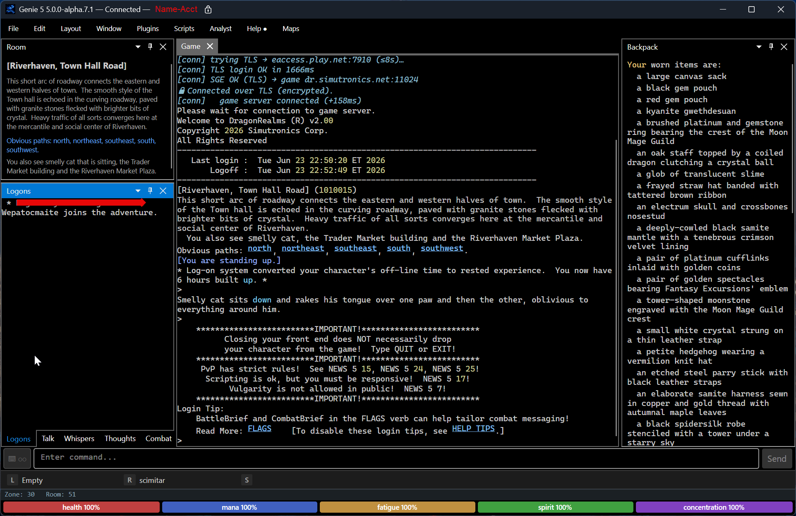
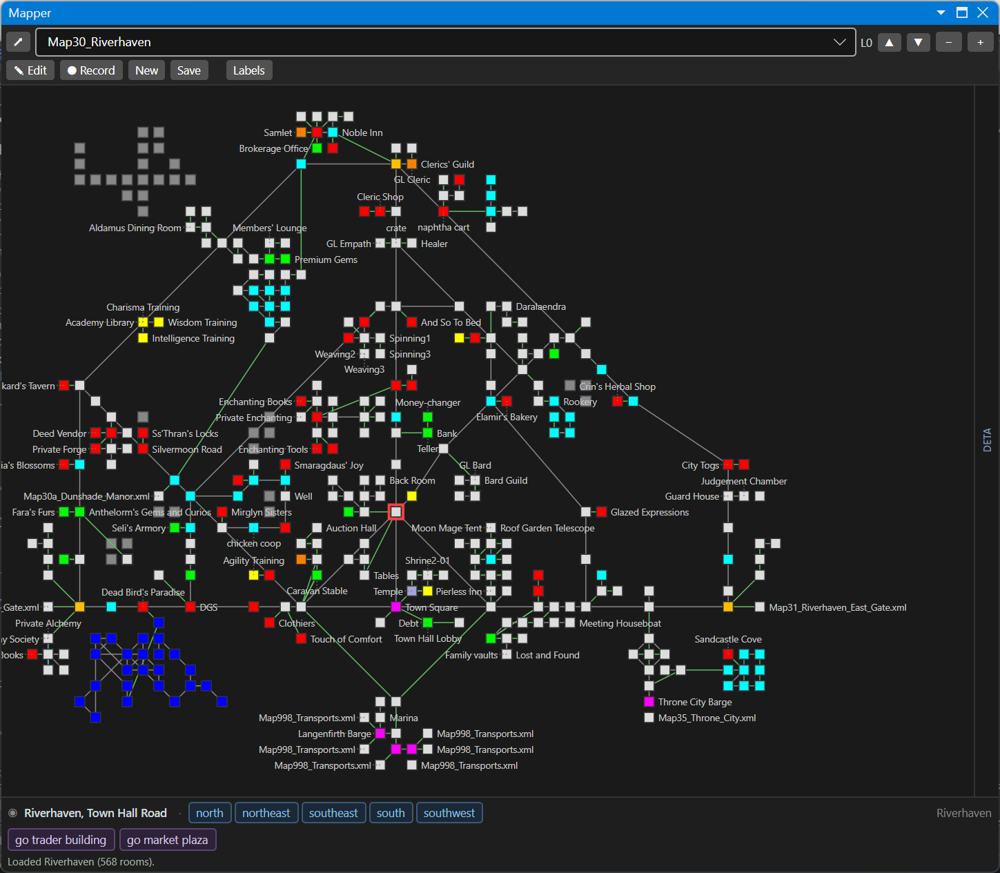
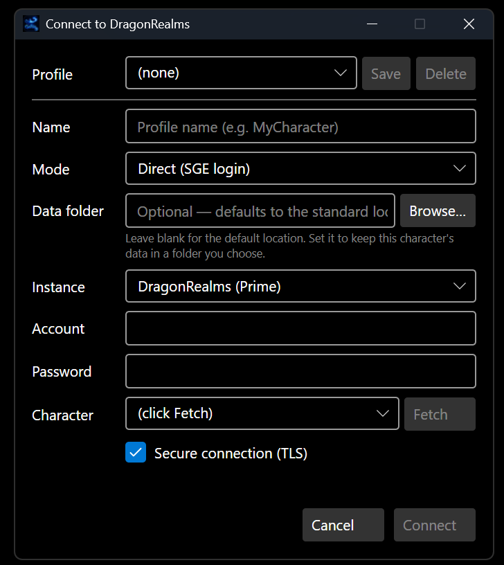

# Genie 5

[](https://discord.gg/MtmzE2w)
[](https://github.com/GenieClient/Genie5/releases)
[](LICENSE)

**A cross-platform, modern successor to [Genie 4](https://github.com/GenieClient) — the long-running Windows client for [DragonRealms](https://www.play.net/dr), Simutronics' text-based MMO.**

> ⚠️ **Alpha** — Genie 5 is in active development, several alphas in. It targets feature parity with the most-used 80% of Genie 4 while running natively on Windows, macOS, and Linux. Expect rough edges. File issues; PRs welcome.

## Screenshots

A live DragonRealms session — game stream, Room panel, inventory, and stream tabs:



| Mapper | Connect dialog |
|---|---|
|  |  |

## Why Genie 5

The Genie 4 codebase is WinForms + Windows-only and hasn't kept pace with modern .NET, cross-platform tooling, or the broader scripting ecosystem. Genie 5 is a clean rewrite that:

- **Runs everywhere** — Windows, macOS, and Linux native, courtesy of [Avalonia UI](https://avaloniaui.net/) and .NET 8
- **Stays compatible** — runs your existing Genie 4 `.cmd` scripts, profile files, and `.map` zone data
- **Plays well with the ecosystem** — supports direct SGE auth, [Lich 5](https://github.com/elanthia-online/lich-5) proxy, and dev-replay from recorded sessions
- **Is built for inspection** — clean `Genie.Core` library with no UI dependencies; embed it in other clients, plugins, or test harnesses

## Status

| Layer | State |
|---|---|
| SGE authentication (StormFront + Wizard modes; optional TLS login) | ✅ Working |
| DragonRealms XML parser (`<component>`, `<d>`, `<a href>`, `<container>`, `<roundTime>`, etc.) | ✅ Working |
| Live game session — connect (Direct SGE / Lich proxy picker), play, type commands | ✅ Working |
| Genie 4 `.cmd` script engine (labels, `MATCH`, `GOSUB`, `$variables`, `WAITFOR`, etc.) | ✅ Working |
| Rules engines (`#alias`, `#trigger`, `#highlight`, `#substitute`, `#gag`, `#macro`, `#class`, `#var`) + per-engine master toggles (File menu / `#config`) | ✅ Working with `.cfg` persistence |
| Per-character profile storage with AES-GCM password encryption | ✅ Working |
| Dockable UI panels (vitals, icon bar, room, mobs/players, inventory, mapper, experience, active spells, injuries, stream tabs) — named save/load layouts + MDI windowed mode | ✅ Working |
| Named script windows (`#window`, `#link`, `#log`, `#clear`, directed `#echo >window`) — Genie 4 menu scripts (`mm_train` et al.) run as-is | ✅ Working |
| Mapper — click-to-goto, `#goto`/`#go2`, room/zone tags + `#goto @tag`, `$roomid`/`$zoneid`/`$zonename` script vars, zone fingerprinting, Less Obvious Paths | ✅ Working (auto-walk is a roadmap item) |
| Session Recorder for raw-XML capture | ✅ Working |
| Lich 5 proxy mode (`ConnectionMode.LichProxy`) | ✅ Working |
| Dev-replay mode (replay recorded sessions through the engine) | ✅ Working (via Console) |
| ~~LAMP 2.0 cross-platform updater~~ | ❌ Canceled — superseded by the in-app updater below |
| In-app updater (Velopack) — Core / Maps / Plugins / Scripts update tabs, per-kind auto-update policies (Update Settings), apply-on-close client updates, Help-menu badge, startup background check | ✅ Working (macOS/Linux Core packaging on the roadmap) |
| Plugin host — `IGeniePlugin`/`IPluginHost` contract, per-plugin assembly-load-context (load/unload/reload), Plugins menu + `#plugin` command, first external plugin (`Plugin_EXPTrackerV5`) | ✅ Working (marketplace + plugin signing/trust on the roadmap) |
| JavaScript (`.js`) array scripts via Jint — `genie.*` API (put/waitFor/matchWait/pause/timers/vars), coexists with `.cmd`, memory + runaway-loop guards | ✅ Working |
| `#connect` / `#reconnect` / `#lichconnect` — typed/scripted login (Genie 4 parity; saved-profile, explicit, and reconnect forms; password-masked) | ✅ Working |
| Analyst Capture — redacted, recipe-driven session capture for parser/analysis (other-player speech stripped by default) | ✅ Working |
| Report parser gap — when the game sends an element Genie doesn't recognize, a one-click prompt opens a **pre-filled, pre-redacted** GitHub issue in your browser (nothing sent until you submit) | ✅ Working |
| Performance overlay — live per-stage pipeline timing + running-`.js` list, behind the Performance menu | ✅ Working |
| Game prompt in the window — `prompt` string + `promptbreak` (own-line) / `promptforce` (reconstructed status letters) | ✅ Working |
| Portrait panel — DR room/scene artwork (`#config showimages`), fetched from the play.net art CDN | ✅ Working |
| Preset colouring — room descriptions / whispers / speech render in their palette colours (Configuration → Presets), plus MonsterBold creature highlighting | ✅ Working |
| Sound — SFX on triggers/highlights + `#play` command (cross-platform: winmm / afplay / paplay) | ✅ Working |
| `#config` settings system (`settings.cfg`, ~20 Genie 4 settings + Scripts tab); reserved/live `$variables` exposed and listed by `#var` | ✅ Working |
| Visual trigger / flow designer | 🚧 Roadmap |
| AI-assisted automation (advisor-only mode) | 🚧 Roadmap |

See [backlog](docs/ROADMAP.md) for the full feature roadmap.

## Installation

### Download a pre-built build (recommended)

Grab the [latest release](https://github.com/GenieClient/Genie5/releases/latest) and pick your platform:

| Platform | Installer | Portable |
|---|---|---|
| **Windows** | `01-Windows-Genie5-Setup.exe` | `01-Windows-Genie5-Portable.zip` |
| **macOS (Apple Silicon)** | `02-macOS-Apple-Silicon-Genie5.dmg` (or `.pkg`) | `02-macOS-Apple-Silicon-Genie5-Portable.zip` |
| **macOS (Intel)** | `03-macOS-Intel-Genie5.dmg` (or `.pkg`) | `03-macOS-Intel-Genie5-Portable.zip` |
| **Linux (x64)** | `04-Linux-Genie5.AppImage` | — |

The **Setup.exe** / **.pkg** / **AppImage** builds register for in-app updates; the **Portable** `.zip` builds don't. Builds are **unsigned** for now, so you'll see a first-launch warning — the [Installation guide](https://github.com/GenieClient/Genie5/wiki/Installation) has the per-platform "unknown publisher" / Gatekeeper steps.

### Build from source

Requires the [.NET 8 SDK](https://dotnet.microsoft.com/download/dotnet/8.0).

```sh
git clone https://github.com/GenieClient/Genie5.git
cd Genie5
dotnet build -c Release
dotnet run --project src/Genie.App
```

On first launch Genie 5 will:

1. Migrate any existing Genie 4 scripts from `%USERPROFILE%\Documents\Genie 4\Scripts\` into its own `Scripts/` folder (Windows only — no-op elsewhere)
2. Migrate any existing Genie 4 maps from `%USERPROFILE%\Documents\Genie 4\Maps\` (Windows only)
3. Create `{AppData}/Genie5/Config/` for `.cfg` rule files and per-character profile data

## Quick start

1. **Launch Genie 5** and use **File → Connect…**
2. **Enter your DragonRealms account name + password**, then click **Fetch** to retrieve your character list
3. **Pick a character** and click **Connect**
4. **Type commands** in the input bar at the bottom; click `<d>` links in game text to send the underlying command
5. **Save the connection** as a profile so you don't have to retype next time — passwords are encrypted on disk (AES-256-GCM)

### Running your first script

Genie 4 `.cmd` scripts go in `{AppData}/Genie5/Scripts/`. From the game window:

```
.myscript           # runs Scripts/myscript.cmd
.myscript arg1 arg2 # passes %1 = arg1, %2 = arg2
#scripts            # lists running scripts
#stop myscript      # aborts a running script
```

The script engine is a faithful port of Genie 4's Wizard-derived dialect — labels, `GOSUB`/`RETURN`, `MATCH`/`MATCHRE`, `$variables`, `%variables`, `PAUSE`, `WAIT`, `WAITFOR`, `PUT`, `def()`, the whole vocabulary. If a script worked in Genie 4 and doesn't work here, [file an issue](https://github.com/GenieClient/Genie5/issues/new) — we treat script-compat regressions as bugs.

## Lich 5 interoperability

Genie 5 plays nicely with [Lich 5](https://github.com/elanthia-online/lich-5). Two integration paths:

- **Lich proxy mode** — Lich runs as your auth front-end and forwards a clean DR stream to Genie on `127.0.0.1:8000`. Pick `Lich Proxy` in the Connect dialog. Your Lich Ruby scripts continue to work; Genie sees them as ordinary game output.
- **Direct SGE + Lich passive** — Genie handles auth itself (no Lich required), and you can run any Lich-managed automation in parallel using Lich's own command channel.

## DragonRealms policy compliance

Genie 5 aims to be a good DragonRealms frontend. DR's [Scripting Policy](https://elanthipedia.play.net/Policy:Scripting_policy) asks that you stay **responsive to the game** while you play — it does **not** require the client window to stay focused, and Genie doesn't try to police how you play. Staying within policy is the player's call. That said, a few design choices keep Genie firmly on the responsive side, and the client itself avoids unattended automation:

- **No auto-reconnect.** If you disconnect, you reconnect by hand.
- **No agentive AI mode.** AI features (when they ship) are **advisor-only** — they surface suggestions in a panel you read, never drive game commands directly.
- **No headless mode.** Genie is a UI client, not a background service.
- **No shipping other players' speech to external services.** The AI context buffer filters out whisper / talk / thoughts / familiar / tells before any external API call.

There's also an **optional** idle backstop for click-to-walk / `#goto` travel that can pause a walk after the window has been unfocused for a while. It's **off by default** and fully configurable — purely for users who want it.

See [docs/POLICY.md](docs/POLICY.md) for the details.

## Architecture

```
TCP bytes
  └─► GameConnection          (SgeAuthClient or LichProxy)
        └─► RawXmlStream      (hot IObservable<string>, always on)
              ├─► DrXmlParser.Feed()
              │     └─► GameEvents  (typed records: TextEvent, NavEvent, …)
              │               └─► GameStateEngine → GameState (live snapshot)
              └─► AiRawStream (toggleable, never blocks parser)
                    └─► AiContextBuffer → AI vendor API → AnalysisReady event
```

- **Genie.Core** — pure class library, zero UI dependencies. Connection, parser, game state, script engine, AI pipeline, rules engines.
- **Genie.App** — the Avalonia GUI host; binds to Core observables, owns no game-logic state.

## Reference

| Resource | Why it's relevant |
|---|---|
| [Genie 4 source](https://github.com/GenieClient) | Original Windows client; canonical reference for `.cmd` parity |
| [Lich 5](https://github.com/elanthia-online/lich-5) | Ruby proxy that runs *on top of* Genie, not a competitor |
| [DR-Genie-Scripts](https://github.com/Tirost/DR-Genie-Scripts) | Largest community script collection; our compatibility test set |
| [Elanthipedia](https://elanthipedia.play.net/Main_Page) | DR's community wiki |
| [Mudlet](https://www.mudlet.org/) | Cross-platform MUD client; possible expansion target for SGE/DR support |

## Contributing

See [CONTRIBUTING.md](CONTRIBUTING.md). Bug reports, feature requests, and PRs all welcome. Security issues go through the process in [SECURITY.md](SECURITY.md).

## Community

- **Discord** — [discord.gg/MtmzE2w](https://discord.gg/MtmzE2w) — the long-running Genie community server, shared with Genie 4. Drop in for alpha-tester chat, scripting help, mapper questions, or general DR conversation.
- **Issues** — [GitHub Issues](https://github.com/GenieClient/Genie5/issues) for bug reports + feature requests
- **Discussions** — [GitHub Discussions](https://github.com/GenieClient/Genie5/discussions) for Q&A, ideas, and show-and-tell

## Code signing policy

Free code signing for Windows release builds is provided by [SignPath.io](https://signpath.io/), with a free code signing certificate from the [SignPath Foundation](https://signpath.org/).

**Current alpha builds are not yet code-signed** — Windows SmartScreen and macOS Gatekeeper will show a first-launch "unknown publisher" warning. Trusted-signed Windows binaries are planned for a future release, pending SignPath Foundation certificate approval. Once active, each release will be built from this repository's source via GitHub Actions and manually approved before signing.

### Roles

- **Authors / Committers:** [@monil2233](https://github.com/monil2233) (project maintainer; commits to this repository).
- **Reviewers:** [@monil2233](https://github.com/monil2233) (reviews each signing request in the SignPath UI before approval).
- **Approvers:** [@monil2233](https://github.com/monil2233) (final approval that triggers the signing operation).

For solo-maintainer alpha-stage projects, all three roles consolidated on the maintainer is the standard SignPath Foundation arrangement. As the contributor base grows and a co-maintainer takes ownership, this section will be updated to reflect a separation between Reviewer and Approver per [SignPath's two-person-rule guidance](https://about.signpath.io/documentation/projects).

### Privacy policy

This program will not transfer any information to other networked systems unless specifically requested by the user or the person installing or operating it. Genie 5 connects only to Simutronics' official DragonRealms authentication and game servers (`play.net` / `simutronics.net`) and, when the user configures it, to a local [Lich 5](https://github.com/elanthia-online/lich-5) proxy. Account credentials are stored locally, encrypted with AES-256-GCM, and are transmitted only to the official authentication servers. No data is collected by the Genie 5 maintainers.

## Credits

See [CREDITS.md](CREDITS.md) for art and non-code attributions. The app icon, status-indicator glyphs, and compass-direction icons are by [@dylb0t](https://github.com/dylb0t), donated under GPL-3.0.

## License

[GPL-3.0](LICENSE). Same license as Lich 5, aligning Genie 5 with the broader DR-tooling ecosystem.
