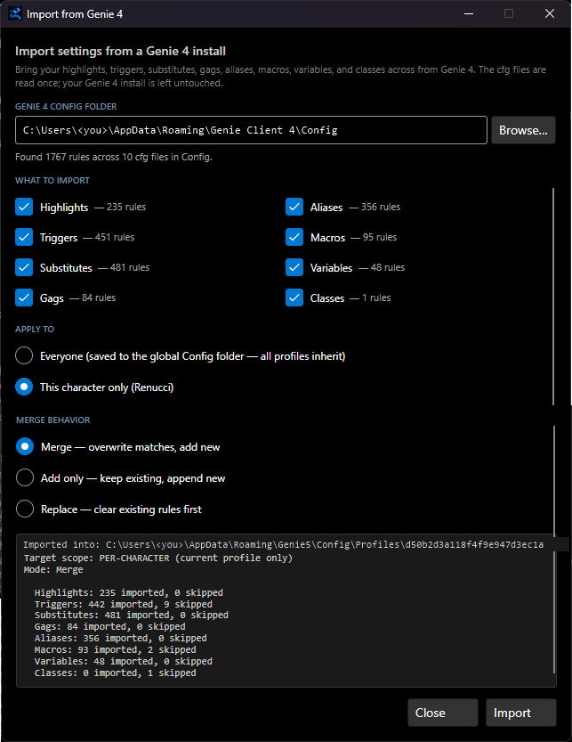

# Importing Genie 4 Config

If you're coming from Genie 4, you don't have to recreate your aliases, triggers, highlights, and so on by hand. Genie 5 reads Genie 4's `.cfg` files directly and folds their contents into your Genie 5 setup.

## What can be imported

The **File → Import from Genie 4…** dialog imports these rule categories (each with its own checkbox so you can pick a subset):

| Genie 4 file | Genie 5 destination |
| --- | --- |
| `aliases.cfg` | Aliases |
| `triggers.cfg` | Triggers (pattern + command + class association) |
| `highlights.cfg` | Highlights (fore/back colours) |
| `substitutes.cfg` | Substitutes (text rewrite rules) |
| `gags.cfg` | Gags (line suppression) |
| `macros.cfg` | Macros (keyboard shortcuts) |
| `variables.cfg` | Variables (persistent `%var` values) |
| `classes.cfg` | Classes (boolean on/off toggles) |

The importer also understands `names.cfg` (name highlights) and `presets.cfg` (colour scheme) where present.

## Finding your Genie 4 install

Genie 4 stores its `.cfg` files in a `Config` folder, typically:

| OS | Path |
| --- | --- |
| Windows (default) | `%LOCALAPPDATA%\Genie\Config\` |
| Windows (older installs) | `%APPDATA%\Genie Client 4\Config\` |
| Windows (portable) | the `Config\` subfolder of wherever you extracted Genie |
| Wine on macOS/Linux | inside the wineprefix, e.g. `~/.wine/drive_c/users/<you>/Local Settings/Application Data/Genie/Config/` |

Look for a folder containing `aliases.cfg`, `triggers.cfg`, etc. — that's your source.

> **Multiple Genie 4 profiles?** Each profile usually has its own `.cfg` set. Pick one character's folder first; you can re-run the import later against another folder to layer on more rules.

## Running the import

1. Launch Genie 5 and choose **File → Import from Genie 4…**.
2. **Source folder** — click **Browse…** and select your Genie 4 `Config` directory. Genie 5 **probes** the folder and shows a count next to each category (e.g. "Triggers: 45"), so you can confirm it found the right place before committing.
3. **Per-category checkboxes** — untick anything you don't want (Highlights, Triggers, Substitutes, Gags, Aliases, Macros, Variables, Classes).
4. **Target** — choose where the rules land:
   - **Current character's profile** — imports into the connected character's `Profiles/<Char>-<Account>/` set.
   - **Global / shared config** — imports into the shared `Config/` baseline.
   (See [Application Folders](Application-Folders) for the difference.)
5. **Mode**:
   - **Merge** — keep existing rules; incoming rules with a matching key overwrite. Good default.
   - **Add only** — append everything without overwriting.
   - **Replace** — clear that category in Genie 5 first, then import. Clean for a one-shot migration; destructive if you'd already configured Genie 5.
6. Click **Import**.

When it finishes, the result line reports per-category counts (imported / skipped). Skipped lines are usually a malformed pattern in the source — those rows are simply not added. **The import is read-only against your Genie 4 files** — the originals on disk are untouched.

## What's NOT imported

- **Scripts (`*.cmd`)** — these aren't `.cfg`; they're plain text in Genie 4's `Scripts` folder. Copy them straight into Genie 5's [Scripts folder](Application-Folders) and run them as `.scriptname`.
- **Maps (`*.xml`)** — imported through the mapper, not this dialog. See [Updating Maps and Scripts](Updating-Maps-and-Scripts). (Genie 5 uses the same Genie 4 XML map format, so maps largely carry over directly.)
- **Account passwords** — for security, Genie 5 never reads Genie 4's stored credentials. Re-enter once via **File → Connect…** and save as a Genie 5 profile (encrypted AES-256-GCM).
- **Window layouts** — Genie 5's docking model differs from Genie 4's MDI. Re-arrange via the **Window** menu and save via **Layout → Save Layout As…**.

## Re-importing

You can run the import again any time. Prefer **Add only** or **Merge** for incremental top-ups and review the result counts — duplicates created by repeated imports are removed by hand via **Edit → Configuration…**.

## Troubleshooting

| Symptom | Likely cause |
| --- | --- |
| Probe shows 0 for everything | The selected folder isn't a Genie 4 `Config` directory. Confirm it contains `aliases.cfg`. |
| One category imports 0 | That `.cfg` is empty in your Genie 4 install. |
| Rules use stale values | Imported `variables.cfg` carried old session state — edit via **Edit → Configuration → Variables**. |
| Colours look slightly off | The import preserves your exact hex values; tweak via **Edit → Configuration → Highlights**. |
