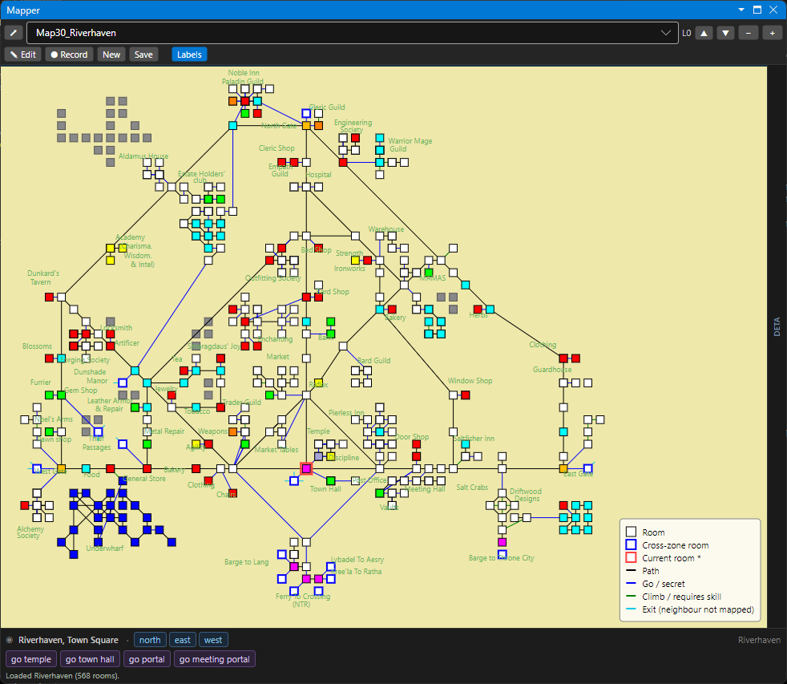
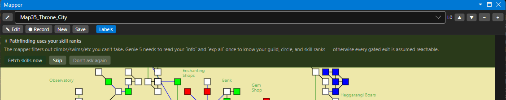
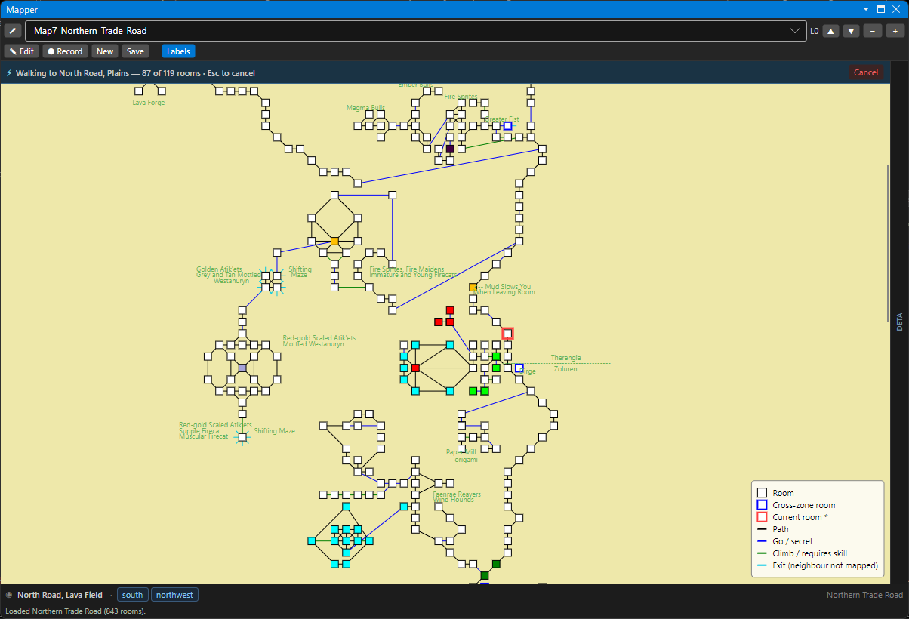
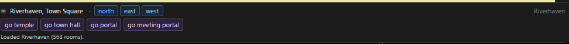

# The Mapper

The mapper knows where you are, draws the zone you're in, and can walk you to any room you click. It reads the community zone maps (the same XML format Genie 4 uses) and tracks your position as you move.

## The map panel

The Mapper panel (**floating** in its own window by default; dock it by dragging, or toggle it via **Window**) shows the current zone with your room highlighted. Rooms are drawn as nodes connected by their exits, color-coded by exit type (compass directions, vertical moves, and special exits like `go gate` or `climb wall`). Scroll to zoom; drag to pan.

As you walk, Genie matches each new room to a node and re-centers on you. When you enter a room it doesn't recognize in the current zone, it can auto-switch to the zone that contains it.

## Finding your room

Genie identifies your current room from what the game sends — the room title, the obvious paths, the description, and (when present) the server's room id. It resolves position with a priority ladder: a known server-room id is definitive; otherwise it follows the exit you just used from your last known room; otherwise it fingerprints the room (title + exits) and disambiguates by neighborhood and description. When it genuinely can't tell, it declines rather than guessing — a wrong lock-in would cascade through every later move.

### Lookup vs. learning

- **Lookup-only (default)** — Genie matches you against the community map but never changes the map files.
- **Learning (AutoMapper toggle on)** — Genie also stamps server-room ids onto matched rooms, records exits it sees you use, and adds new rooms it doesn't recognize, saving the zone back to disk. This makes your future visits resolve instantly and fills gaps in the community map.

## Click-to-walk

Click (or right-click → go) a room on the map and Genie plans a route and walks you there, one room at a time. Pathfinding is **skill-aware**: exits your character can't take — a climb beyond your skill, a guild-locked door, a level-gated arc — are excluded from the route, so it won't try to send you somewhere you can't go.

The first time skill-aware routing needs your numbers, the Mapper shows a one-time banner offering to **fetch your skills** (it sends the game's own skill command and reads the reply); **Skip** routes without skill filtering, and **Don't ask again** silences the banner.

Walking goes through the normal command path (the same one your typing uses), so roundtime is handled automatically and your aliases/triggers still apply. If you get knocked off the planned route, the walk **cancels** rather than firing the wrong command.

### Attended-mode rules (why it's safe)

The walker is deliberately conservative — it assists an attentive player and is responsive to your intent (a click or `#goto`), stepping under roundtime gating rather than firing a burst of commands:

- **Cancels** on **Esc**, on any command you type, on disconnect, or if you walk off the planned path.
- **Never auto-resumes** across a disconnect — a fresh walk needs a fresh click.
- A visible strip shows progress and a Cancel/Resume control.
- **Optional:** an idle pause can suspend a walk after the window has been unfocused for a configurable interval. It's **off by default** (DR policy is about responsiveness, not window focus); turn it on if you want the extra backstop, then click **Resume** to continue.

See [Policy Compliance](Policy-Compliance) for the full reasoning.

## Less Obvious Paths

DragonRealms rooms have "obvious paths," but maps also record the non-obvious connections (a trellis you can climb, an alley with no signposted exit). Genie surfaces these as clickable buttons so you can take them without memorizing the verb.

## Room notes

With learning on, you can add notes to a room (a landmark, a warning, a shop name); notes are saved into the zone XML and render as labels on the map.

## Where maps live

Zone files are XML — one per zone — in your **Maps** folder (`Map1_Crossing.xml`, `Map60_Southern_Trade_Road.xml`, …), alongside a single `ZoneConnections.xml` describing cross-zone transit links. Jump there with **File → Open Maps Folder**; change the location with **File → Change Maps Directory…**. See [Application Folders](Application-Folders).

Because Genie 5 uses the **same Genie 4 map format**, maps move between the two clients cleanly, and the 24+ community map forks all work.

## Getting and updating maps

- **From the community repo** — **File → Update Maps from Official Repo…** pulls the latest zone XML and merges it with your local progress (upstream layout changes come down; your stamped room ids survive).
- **From a Genie 4 install** — import your existing `*.xml` zone files once.

Full details: [Updating Maps & Scripts](Updating-Maps-and-Scripts).

## Cross-zone travel

Single-zone walking is built in. Routing **across** zones — boats, ferries, climb-walls between map files — runs on a separate transit graph (`ZoneConnections.xml`) with its own pathfinder and editor. The infrastructure and the editor are in place; feeding full cross-zone routes to the walker is being finished. See [Cross-Zone Travel](Cross-Zone-Travel).

## Related

- [Cross-Zone Travel](Cross-Zone-Travel) — the multi-zone transit graph and editor.
- [Updating Maps & Scripts](Updating-Maps-and-Scripts) — keep maps current.
- [Policy Compliance](Policy-Compliance) — why the walker behaves the way it does.
