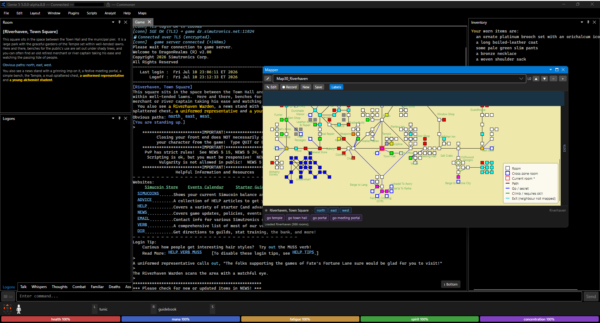

# Quick Start

Your first five minutes with Genie 5 — from launching the client to playing DragonRealms, with a profile saved and a script running. If you haven't installed it yet, do [Installation](Installation) first.

> **Coming from Genie 4?** Get connected with this page, then run [Importing from Genie 4](Importing-Genie4-Config) to bring your aliases, triggers, and highlights across.

## 1. Launch

If you installed a pre-built build, launch it the normal way for your OS:

- **Windows** — from the Start menu (Setup install) or run `Genie5.exe` from the portable folder.
- **macOS** — open **Genie5** from Applications (first time: **right-click → Open** to clear Gatekeeper).
- **Linux** — `./Genie5.AppImage` (make it executable first with `chmod +x`).

Building from source instead? Run `dotnet run --project src/Genie.App` from the repo root.

On first launch Genie 5 creates its per-user data folder (`Config/`, `Scripts/`, `Maps/`, `Logs/`) — see [Application Folders](Application-Folders) for where that lives on your OS.

## 2. Connect

1. **File → Connect…**
2. Enter your **DragonRealms account name** and **password**.
3. Click **Fetch** to retrieve your character list. (Genie 5 talks to Simutronics' login service to get it — your password goes only to the official servers.)
4. Pick a **character** and click **Connect**.

Genie 5 logs in, finds the game server, and the room you're standing in appears in the game window. The full walkthrough — including Lich and replay modes — is on [Connecting & Profiles](Connecting).

## 3. Look around the interface



The default layout is three columns:

- **Left** — the current **Room** (title, description, exits) and stream tabs (Talk, Whispers, Thoughts, Combat, Logons).
- **Center** — the main **game text** window.
- **Right** — your **inventory / backpack**.
- **Bottom** — the **vitals** bar (health / mana / fatigue / spirit / concentration), the **hands** strip (what you're holding, your prepared spell, your stance), and the **command bar** where you type.
- The **Mapper** opens **floating** in its own window — dock it by dragging if you prefer it embedded.

Rearrange anything by dragging panel tabs; toggle panels from the **Window** menu. See [The Interface](The-Interface) for the tour.

## 4. Play

Type a command in the bar at the bottom and press **Enter**:

```
look
north
get my pack
```

- **Clickable links** — DragonRealms marks many nouns and menu options as links. Click one to send its underlying command; no typing needed.
- **Command history** — press **↑ / ↓** to recall previous commands.

## 5. Save a profile

So you don't retype next time:

- In the Connect dialog, save the connection as a **profile**. Your password is encrypted on disk with **AES-256-GCM** — Genie 5 never stores it in plain text. Profiles are per-character, so each character keeps its own settings. Details on [Connecting & Profiles](Connecting).

## 6. Run your first script

Genie 5 runs Genie 4 `.cmd` scripts. Create a file called `hello.cmd` in your [Scripts folder](Application-Folders):

```
echo Hello, %1!
```

Then run it from the command bar (scripts are prefixed with `.`):

```
.hello world
```

Output: `Hello, world!`. The `%1` was filled in by the argument you passed.

Useful script commands at the command bar:

```
.myscript          # run Scripts/myscript.cmd
#scripts           # list running scripts
#stop myscript     # stop a running script
```

The friendly tour is on [Scripting](Scripting); the complete language is on [Scripting Reference](Scripting-Reference).

## Where to next

- **Customize your output** — colors, shortcuts, and automatic responses: [Configuration & Rules](Configuration).
- **Find your way around** — [The Mapper](Mapper).
- **Get the community maps** — [Updating Maps & Scripts](Updating-Maps-and-Scripts).
- **Something not working?** — [Troubleshooting & FAQ](Troubleshooting).
