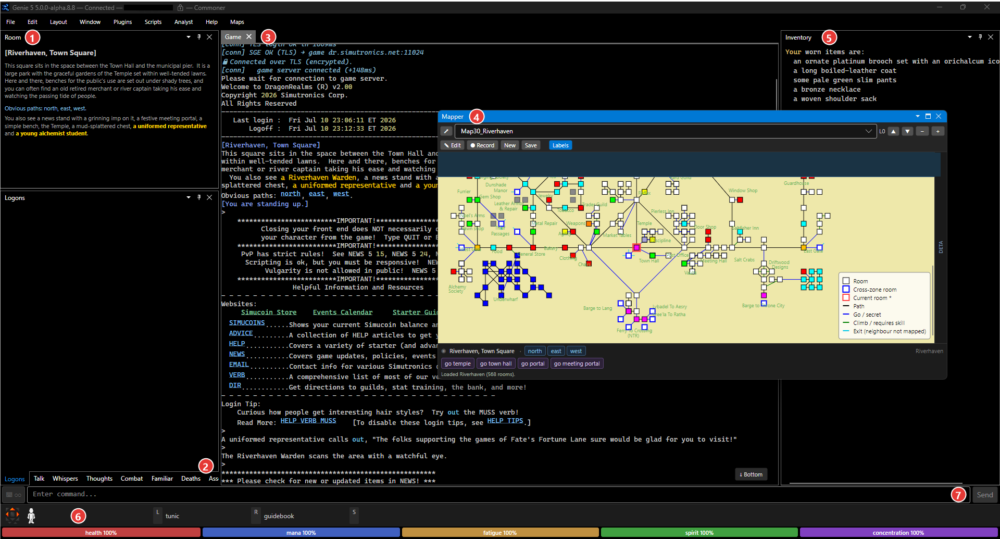
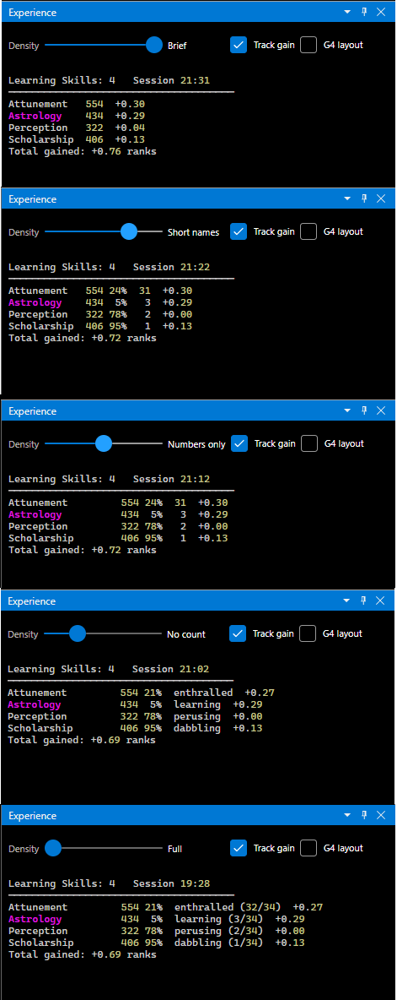
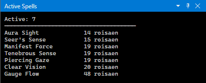
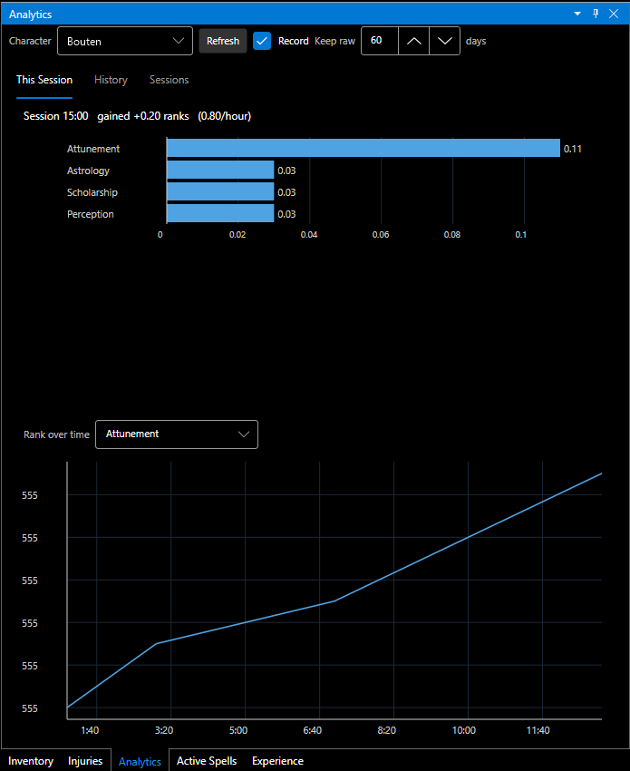
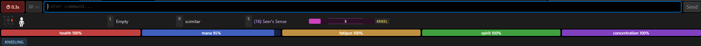

# The Interface

Genie 5's window is a set of **dockable panels** around a central game-text view. You can show, hide, drag, float, and re-dock any panel, then save the arrangement as a layout. This page is a tour of what's on screen and how to rearrange it.

## The default layout

Out of the box you get a three-column arrangement:

- **Left column** — the **Room** panel (title, description, obvious paths) and a cluster of **stream tabs** (Talk, Whispers, Thoughts, Combat, Logons).
- **Center column** — the main **Game** text window.
- **Right column** — your **Inventory / Backpack**.
- **Bottom strips** — **vitals**, the **hands** strip, and the **command bar**.
- The **Mapper** starts **floating** in its own window; drag it onto the dock if you'd rather embed it (below the Game window is the classic Genie 4 spot).

① **Room** panel &nbsp;·&nbsp; ② **stream tabs** &nbsp;·&nbsp; ③ **Game** window &nbsp;·&nbsp; ④ **Mapper** (floating by default) &nbsp;·&nbsp; ⑤ **Inventory** &nbsp;·&nbsp; ⑥ **hands strip & vitals** &nbsp;·&nbsp; ⑦ **command bar** with roundtime

## The panels

| Panel | Shows |
| --- | --- |
| **Game** | The main scrolling game text. Supports clickable links and per-tag visibility (below). |
| **Room** | Current room title, description, and obvious paths — split out from the game text so it's always glanceable. Creature names honor MonsterBold coloring. |
| **Mobs / Players** | The creatures and the other players in the room, as their own glanceable lists. |
| **Inventory / Backpack** | What you're carrying. |
| **Inventory View** | A searchable catalog of everything your characters own — person, vault, deed register, home, and Trader storage — with item weight/size columns and a player-shop price search. See [the Inventory View window](#the-inventory-view-window) below. |
| **Mapper** | The zone map with your current room highlighted; click a room to walk there. Starts **floating** in its own window; dock it by dragging. See [The Mapper](Mapper). |
| **Experience** | Live skill learning states. A **Density** slider on the panel condenses each skill line to taste (**Full → No count → Numbers only → Short names → Brief**); the same setting is scriptable as `#config experiencedensity`. |
| **Active Spells** | Your running spell effects with time remaining. |
| **Analytics** | Charts over your experience history — session gain bars, a long-horizon rank curve per skill, and session-vs-session comparison. See [the Analytics panel](#the-analytics-panel) below. |
| **Scripts** | A separate scrollback for script output (`[script]` lines, `#echo`, debug traces), so a busy hunt script doesn't clutter the main window. |
| **Injuries** | A body silhouette showing per-region wounds and scars from the game's injury data, colour-coded by severity, with a text list alongside. An opt-in auto-refresh (`#config injuriespoll N`) can poll `health` every *N* seconds to refine the nervous-system reading while the panel is open. |
| **Portrait** | DragonRealms room/scene artwork for the current area (`#config showimages`) — the panel Genie 4 called Portrait. |
| **Raw XML** | The unparsed server stream, for debugging and parser spelunking. |
| **Stream tabs** | DragonRealms routes certain text to named streams. Genie surfaces **Talk**, **Whispers**, **Thoughts**, **Combat**, **Logons**, **Familiar**, **Deaths**, **Assess**, **Atmospherics**, **Log**, and **Item Log** as their own windows so they each keep a clean scrollback. (Speech and whispers also appear in the main window — DragonRealms sends them to both by design.) |

Toggle any panel from the **Window** menu. Drag a panel's tab to re-dock it; drag it out to **float** it in its own window, and drag it back to re-dock.

*The same Experience panel at each of the five **Density** stops — Brief (top) through Full (bottom).*

*The Active Spells panel — each effect with its time remaining.*

Every stream window also has an **"Also show this stream in the Main window"** toggle (Configuration → **Layout** tab, per window) that additionally echoes its lines into the main game window, Genie 4-style. The Layout tab is also where each window's font is set.

Scripts can create their **own named windows** too — the Genie 4 menu-script commands (`#window`, `#link`, `#echo >window`) build clickable menu panels that dock like any other. See the [Scripting Reference](Scripting-Reference#named-windows-links-and-logging).

## The Analytics panel

The **Analytics** panel (toggle it from the **Window** menu) turns the experience data Genie sees into charts. It records skill ranks locally as you play — nothing is uploaded anywhere — and reads that history back across three tabs:

- **This Session** — per-skill gain bars for the current session, plus a rank-over-time line for any skill you select.
- **History** — a long-horizon gain curve per skill, with a **7 / 30 / 90 days / All** range picker.
- **Sessions** — one summary row per past session (duration, total gain, ranks/hour), with a checkbox compare that overlays the normalized gain curves of two or three sessions.

A character dropdown switches whose history you're looking at. The store lives in your data folder (see [Application Folders](Application-Folders)) and fills in as you play — a fresh install shows "no history yet" until your first session.

## The Inventory View window

**Inventory View** (toggle it from the **Window** menu, or type `/iv open`) catalogs everything your characters own. Run `/iv scan` while connected and it walks your possessions — items on your person, your **vault** (if you're holding a vault book), your **deed register**, your **home**, and **Trader storage** — into a per-character tree that persists between sessions and across characters, so you can finally answer "which character has the …?" without logging everyone in.

- **Search all characters** — type in the search box to filter the tree live; matching items highlight, their container chain stays visible, and the count shows how many matched.
- **Wt / Size columns** — each item's weight (stones) and dimensions, filled in automatically from [Elanthipedia's](https://elanthipedia.play.net) item database the first time an item is seen, then cached locally. Items the wiki doesn't document stay blank.
- **Sortable columns** — click **Item**, **Wt**, or **Size** in the header to sort within each container (click again to flip). Handy for spotting what's weighing you down.
- **Wiki Lookup** — opens the selected item's Elanthipedia page in your browser (or the wiki's search when there's no exact page).
- **Find in Shops** — searches current player-shop listings (data from the community-run [DR Service Plaza](https://drservice.info/Plaza/)) for the selected item: price, shop, room, owner, and town. Also available as `/iv shops <text>`.
- **Export** — writes the whole catalog to a CSV file.
- **Remove** — drops the selected character's data from the catalog (two-step confirm).

The catalog is saved to `InventoryView.xml` in your data folder in the same format the Genie 4 InventoryView plugin used, so an existing file carries over as-is. Scans finish with a `InventoryView scan complete` line through the parse pipeline, so a login script can `waitforre` it. Type `/iv help` for the full command list.

## The bottom strips

- **Vitals** — bars for **health, mana, fatigue, spirit, and concentration** (fatigue is DR's stamina bar — Genie labels it the way the game does), plus status badges (kneeling, prone, stunned, hidden, bleeding, …).
- **Icon Bar** — Genie 4's status strip: colour-coded chips below the vitals bar for your posture (dead / standing / kneeling / sitting / prone) plus **STUNNED**, **BLEEDING**, **HIDDEN**, **INVISIBLE**, **WEBBED**, **JOINED** — and two Genie 4 never had: **POISONED** and **DISEASED**. It dims while disconnected. Hide it via **Layout → Icon Bar**.
- **Hands strip** — what's in your **left** and **right** hands, your **prepared spell** (with a cast-time bar), and your **stance**. Its position (top or bottom) is configurable from the **Window** menu.
- **Command bar** — where you type. A **roundtime** indicator shows here (or on the hands strip — your choice) so you can see when you can act again.

## Notices

Two slim, dismissible strips appear just above the vitals bar — but only when there's something to tell you. Each has an **✕** to hide it.

- **Updates available** — shows after the startup check finds a newer Core, map, script, or plugin. Click it to open the **Updates** dialog. See [Keeping Up to Date](Updates).
- **Help improve the parser** — if the game ever sends Genie an element it doesn't recognize, this strip asks whether you'd like to report it. Click it and Genie opens a **pre-filled GitHub issue** in your browser, with the sample **already redacted** (other players' speech removed) and your Genie version attached. **Nothing is sent until you review it and press Submit** — no account data, no automatic posting. It's a one-click way to help Genie's parser keep pace as DragonRealms evolves. Each unknown element only asks once per session.

## The command bar

Type a game command and press **Enter**. Beyond plain commands:

- **Command history** — **↑ / ↓** recall previous input.
- **Meta-commands** start with `#` (for example `#alias`, `#trigger`, `#var`, `#scripts`). These configure Genie rather than going to the game — see [Configuration & Rules](Configuration).
- **Scripts** start with `.` — `.hunt` runs `Scripts/hunt.cmd`. See [Scripting](Scripting).
- **Tab-completion** — start typing a `.scriptname` and press **Tab** to complete it.
- **Multiple commands** — chain with `;` (the separator character).
- **Multi-line paste** — **Edit → Paste Multi Line** pastes clipboard text one line per command.
- **Keyboard scrolling** — **PageUp / PageDown** page the selected game window without leaving the command bar; **Ctrl+PageUp / Ctrl+PageDown** jump to top / bottom, Genie 3/4-style.

## Clickable links

DragonRealms marks many nouns, menu options, and URLs as links:

- **Command links** (`<d>`) — click to send the underlying game command (Genie shows a friendly label where the game provides one).
- **URL links** (`<a href>`) — open in your browser. Genie can confirm before opening external URLs as a safety check.

## Per-tag visibility

The **Window → Game Window** submenu lets you independently show or hide three kinds of lines in the main window:

- **Game text** — what the server sends.
- **Echo** — Genie's own confirmations.
- **Script lines** — output from running scripts.

Turn off script lines, for example, to keep a busy hunt script from cluttering the main window (its output still appears in the Scripts panel).

## Layouts

Rearrange the panels however you like, then keep the arrangement — the **Layout** menu manages it all:

- **Layout → Save Layout As… / Load Layout / Manage Layouts…** — keep several named layouts (a "Combat" layout vs. an "In-Character" layout) and switch between them; **Manage Layouts…** also picks the default.
- **Layout → Reset to Default Layout** restores the three-column arrangement.
- **Layout → Windowed Mode (MDI)** switches from docked panels to free-floating child windows, Genie 4-style.
- **Layout → Always on Top** keeps Genie above other windows.
- **Layout → Align Input to Game Window** makes the command bar track the Game window's width instead of spanning the full frame.
- **Layout → Magic Panels** hides the mana bar, cast bar, and spell labels — tidy on a non-caster.
- **Layout → Icon Bar** shows or hides the status-chip strip.
- Floating the Mapper, hiding panels you don't use, and moving the hands strip are all remembered.

> 🚧 **Roadmap:** light/dark themes are planned but not in the alpha yet.

## Display settings

**Edit → Display Settings…** controls fonts, colors, the roundtime indicator's position, the hands-strip position, and the external editor used by `#edit`.

## Related

- [Configuration & Rules](Configuration) — highlight colors, aliases, triggers, and macros.
- [The Mapper](Mapper) — the map panel in depth.
- [Scripting](Scripting) — automate from the command bar.
